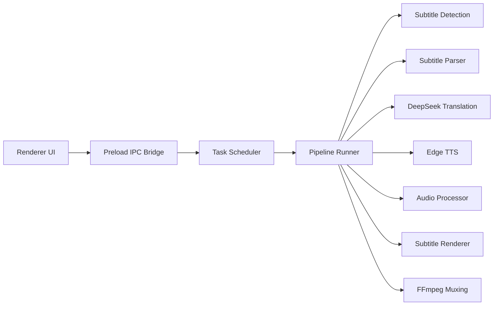

# ChronoDub

A desktop app for generating Chinese subtitles and Chinese dubbing tracks from English-subtitled videos. See [简体中文](./README.zh-CN.md) for the Chinese version.

<p align="left">
  
</p>

<p align="left">
  
</p>

## Overview

ChronoDub combines subtitle parsing, DeepSeek translation, Edge TTS synthesis, and FFmpeg muxing into one Electron workflow.

It is designed around practical dubbing constraints:

- keep subtitle windows as anchors, then retime cues against actual synthesized speech boundaries
- keep speech inside the available subtitle window
- avoid overlap between adjacent voice segments
- preserve technical meaning while making Chinese narration read more naturally

This makes it suitable for tutorial videos, technical walkthroughs, and other narration-heavy content where timing and terminology both matter.

## Features

- Batch import multiple videos from the same folder.
- Auto-detect matching subtitle files by combining naming heuristics with subtitle-content language checks, so the app prefers the original English track instead of only trusting file suffixes.
- Parse `SRT`, `VTT`, and `ASS/SSA` subtitles.
- Translate subtitles with DeepSeek using segment-level translation.
- Keep terminology stable with a glossary and review the generated Chinese subtitles before dubbing.
- Generate Chinese dubbing with Edge TTS and preview voices in the app.
- Measure synthesized duration, apply timing-safe fallback strategies when a segment is too long, and retime cues against actual synthesized speech boundaries.
- Pause, resume, cancel, retry failed tasks, and recover tasks after restart or sleep.
- Export dubbed videos with either external subtitle files or burned-in Chinese subtitles.
- Configure burned subtitle styles with searchable system fonts, size, bold, italic, colors, outline, background fill, background padding, and top/bottom safe-area placement.
- Choose whether output files are written into per-video subfolders or directly into the selected output directory.
- Limit concurrent task execution with configurable local scheduling.

## Workflow

ChronoDub uses subtitle windows as anchors, then fine-tunes cue timing after synthesis using actual speech boundaries.

1. Import video files and detect subtitle candidates, using both naming and subtitle content to prefer the original English track.
2. Parse subtitles and merge cues into synthesis-friendly timing segments.
3. Estimate text budgets from measured voice speed.
4. Translate each segment into natural, accurate Chinese.
5. Review or edit subtitles before starting dubbing.
6. Synthesize audio, measure actual duration, and retry with safe fallbacks when needed.
7. Retime subtitle cues against the accepted synthesized speech boundaries.
8. Assemble the final Chinese audio track and write either an external subtitle file or a burned-in subtitle video.

## Architecture



The app is split into three main parts:

- `renderer`: React UI for task management, subtitle review, and configuration.
- `preload`: IPC bridge that exposes safe APIs to the renderer.
- `main`: Electron services for task scheduling, subtitle detection and parsing, translation, TTS, audio timing, task persistence, subtitle rendering, and FFmpeg orchestration.

## Tech Stack

- Electron + `electron-vite`
- React 19 + TypeScript
- Zustand
- Tailwind CSS + Radix UI
- DeepSeek API
- `node-edge-tts`
- FFmpeg / FFprobe

## Requirements

Before running ChronoDub, make sure you have:

- Node.js 20 or newer
- npm
- `ffmpeg` and `ffprobe`
  - available in system `PATH` during development
  - or bundled under `resources/bin` in packaged builds
- a valid DeepSeek API key
- network access for DeepSeek and Edge TTS

## Installation

### Build From Source

```bash
git clone https://github.com/CodedByLiu/ChronoDub.git
cd ChronoDub
npm install
```

### Start Development Mode

```bash
npm run dev
```

### Build Production Bundles

```bash
npm run build
```

## Packaging

Build a distributable package for your platform:

```bash
npm run dist
```

Platform-specific commands:

```bash
npm run dist:mac
npm run dist:win
npm run dist:linux
```

Artifacts are written to:

```text
release/<version>/
```

## Available Scripts

```bash
# Start the development server and Electron
npm run dev

# Build main, preload, and renderer bundles
npm run build

# Preview the production build locally
npm run preview

# Run lint checks
npm run lint

# Run unit tests
npm test

# Auto-fix lint issues
npm run lint:fix

# Format the repository
npm run format

# Check formatting
npm run format:check

# Package the app
npm run dist
```

## Output Layout

For an input video named `MyVideo.mp4`, ChronoDub supports both subtitle render modes and both folder layouts.

External subtitle mode:

```text
<outputDir>/MyVideo/
  MyVideo.mp4
  MyVideo.srt
```

Burned subtitle mode:

```text
<outputDir>/MyVideo/
  MyVideo.mp4
```

When "Create a subfolder for each video" is disabled, files are written directly into the selected output folder:

```text
<outputDir>/
  MyVideo.mp4
  MyVideo.srt   # only generated in external subtitle mode
```

If multiple source videos share the same basename, ChronoDub will automatically avoid flat-output collisions by reserving unique output file names.

## Configuration Notes

- `Review Mode`
  - `Auto`: start an editable review session with a countdown.
  - `Manual`: wait until you explicitly confirm the Chinese subtitle review.
- `Subtitle Output Mode`
  - `External`: export the dubbed video and a `.srt` file.
  - `Burned`: export a single video with hardcoded Chinese subtitles.
- `Burned Subtitle Style`
  - System font picker with search
  - Font size, bold, italic
  - Text color
  - Outline enable, width, color
  - Background enable, color, opacity, padding
  - Top-safe or bottom-safe placement
  - Safe-area margin
- `Max Concurrent Tasks`
  - Controls how many local tasks run at once.
  - Queued tasks use the latest saved runtime configuration when they actually start.

## Project Structure

```text
src/
├─ components/   React UI components
├─ hooks/        UI hooks
├─ lib/          Frontend utilities
├─ main/         Electron main process and backend services
│  ├─ services/  Pipeline, scheduler, subtitle, audio, ffmpeg, and detection services
│  └─ ...        Task registry, config store, runtime state
├─ preload/      IPC bridge
├─ renderer/     Renderer entry and static assets
├─ stores/       Zustand state management
└─ types/        Shared type definitions
tests/           Node-based unit tests
docs/
├─ chronodub.md  Research and architecture notes
└─ image.png     Application screenshot
scripts/
├─ generate-mac-icon.sh
└─ generate-win-icon.mjs
```

## Troubleshooting

- If subtitle auto-detection fails, confirm the subtitle file is next to the video and that its content is actually the original English subtitle track.
- If translation fails, verify the DeepSeek API key and API connectivity.
- If TTS fails, check network access and test the configured Edge voice in the app first.
- If muxing fails, confirm `ffmpeg` and `ffprobe` are installed and discoverable.
- If a task was interrupted by system sleep, reopen the app and resume it from the task list.
- If burned subtitle styling looks wrong on one specific video, verify the video metadata first; ChronoDub now scales subtitle layout to the detected display size, including rotated videos.

## Contributing

Issues and pull requests are welcome.

## License

No license file is included yet.
