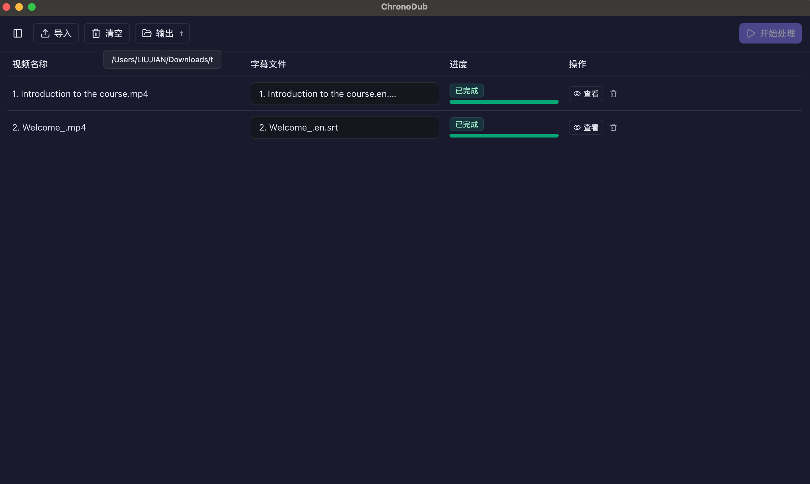
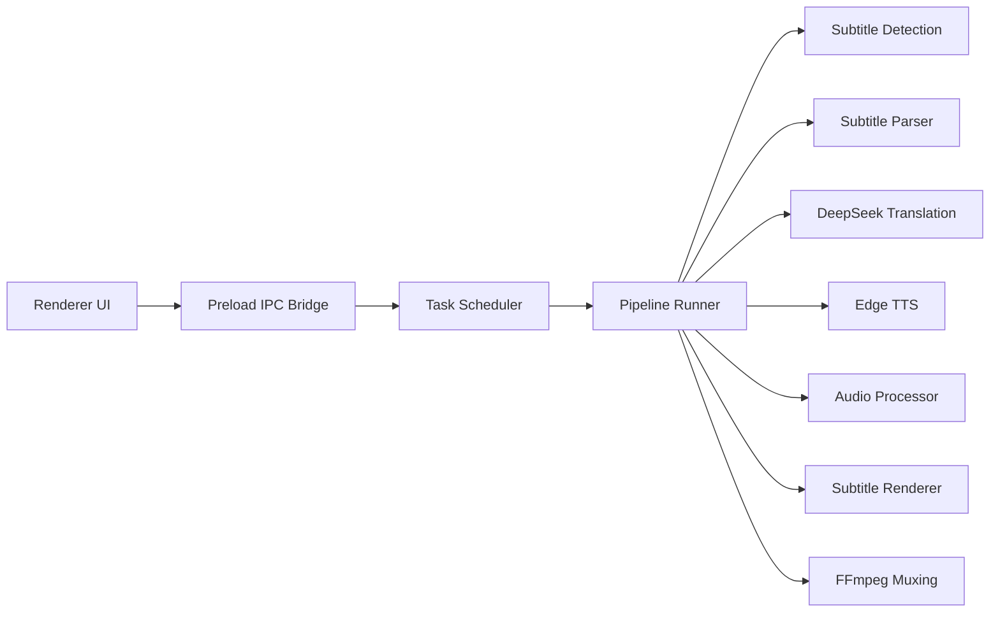

# ChronoDub

一个面向英文字幕视频的中文字幕与中文配音桌面应用。English version: [README.md](./README.md)

<p align="left">
  
</p>

<p align="left">
  
</p>

## 项目简介

ChronoDub 把字幕解析、DeepSeek 翻译、Edge TTS 合成和 FFmpeg 封装整合进同一套 Electron 工作流。

它围绕几条实际配音约束来设计：

- 优先保持原字幕窗口结构，并在合成后按真实发声边界二次校正字幕时间
- 配音尽量落在当前字幕窗口内
- 相邻语音片段不重叠
- 在保证专业含义的前提下，让中文讲解听起来更自然

这使它尤其适合教程视频、技术讲解视频，以及其他对术语准确度和时间同步都有要求的内容。

## 功能特性

- 支持批量导入同一目录下的多个视频。
- 支持结合文件命名和字幕内容语言判断自动识别原英文字幕，不再只依赖后缀命名。
- 支持解析 `SRT`、`VTT`、`ASS/SSA` 字幕。
- 使用 DeepSeek 进行 segment 级英译中翻译。
- 支持术语稳定控制，并可在配音前复核和修改中文字幕。
- 使用 Edge TTS 生成中文配音，并支持应用内试听音色。
- 对已生成语音测量真实时长，在超窗时执行时长安全回退策略，并按真实发声边界二次校正 cue 时间。
- 支持任务暂停、继续、取消、失败重试，以及重启或睡眠后的恢复。
- 支持输出外置字幕文件，或直接生成带硬嵌中文字幕的视频。
- 硬嵌字幕支持可搜索的系统字体、字号、加粗、斜体、颜色、描边、背景填充、背景内边距和顶部/底部安全区位置配置。
- 支持选择“每个视频单独创建输出文件夹”或直接平铺输出到目标目录。
- 支持配置本地并发任务数。

## 工作流程

ChronoDub 以原字幕时间窗为锚点组织整条流水线，并在最终合成后按实际语音边界细调 cue 时间。

1. 导入视频并自动识别候选字幕，结合命名和字幕内容判断原英文字幕。
2. 解析字幕并把 cue 合并成更适合合成的时间段。
3. 根据音色实测语速估算文本预算。
4. 将每个 segment 翻译成自然、准确的中文。
5. 在开始配音前复核或编辑中文字幕。
6. 合成语音并测量真实时长，必要时按安全策略重试。
7. 按最终接受的真实语音边界二次校正字幕 cue 时间。
8. 组装中文音轨，并输出外置字幕结果或硬嵌中文字幕视频。

## 架构说明



应用主要分为三部分：

- `renderer`：React 前端界面，负责任务管理、字幕复核和配置。
- `preload`：向渲染进程暴露安全 IPC 能力的桥接层。
- `main`：Electron 主进程服务，负责任务调度、字幕检测与解析、翻译、TTS、时长控制、任务持久化、字幕渲染和 FFmpeg 编排。

## 技术栈

- Electron + `electron-vite`
- React 19 + TypeScript
- Zustand
- Tailwind CSS + Radix UI
- DeepSeek API
- `node-edge-tts`
- FFmpeg / FFprobe

## 环境要求

运行 ChronoDub 前，请确认你具备：

- Node.js 20 及以上版本
- npm
- `ffmpeg` 与 `ffprobe`
  - 开发环境下可直接从系统 `PATH` 访问
  - 打包环境下可放在 `resources/bin`
- 有效的 DeepSeek API Key
- 可访问 DeepSeek 与 Edge TTS 的网络环境

## 安装与运行

### 从源码启动

```bash
git clone https://github.com/CodedByLiu/ChronoDub.git
cd ChronoDub
npm install
```

### 启动开发环境

```bash
npm run dev
```

### 构建生产产物

```bash
npm run build
```

## 打包

构建当前平台的可分发安装包：

```bash
npm run dist
```

平台专项命令：

```bash
npm run dist:mac
npm run dist:win
npm run dist:linux
```

构建产物输出到：

```text
release/<version>/
```

## 常用脚本

```bash
# 启动 Electron 开发环境
npm run dev

# 构建 main、preload、renderer
npm run build

# 本地预览生产构建
npm run preview

# 运行 ESLint
npm run lint

# 运行单元测试
npm test

# 自动修复 ESLint 问题
npm run lint:fix

# 使用 Prettier 格式化仓库
npm run format

# 检查格式
npm run format:check

# 构建并打包应用
npm run dist
```

## 输出结构

如果输入视频名为 `MyVideo.mp4`，ChronoDub 支持两种字幕输出方式和两种目录组织方式。

外置字幕模式：

```text
<outputDir>/MyVideo/
  MyVideo.mp4
  MyVideo.srt
```

硬嵌字幕模式：

```text
<outputDir>/MyVideo/
  MyVideo.mp4
```

关闭“为每个视频单独创建文件夹”后，文件会直接平铺到输出目录中：

```text
<outputDir>/
  MyVideo.mp4
  MyVideo.srt   # 仅外置字幕模式生成
```

如果多个源视频同名，ChronoDub 会在平铺输出时自动保留唯一文件名，避免成品互相覆盖。

## 配置说明

- `复核模式`
  - `自动复核`：进入可编辑复核阶段，并带倒计时。
  - `手动复核`：必须显式确认后才继续配音。
- `字幕输出方式`
  - `生成字幕文件`：输出配音视频和 `.srt`。
  - `硬嵌字幕`：输出一个带中文字幕的成品视频。
- `硬嵌字幕样式`
  - 可搜索系统字体
  - 字号、加粗、斜体
  - 文字颜色
  - 描边开关、大小、颜色
  - 背景开关、颜色、透明度、内边距
  - 顶部安全区 / 底部安全区
  - 安全区边距
- `最大并发任务数`
  - 控制本地同时处理的任务数量。
  - 排队中的任务会在真正开始时使用最新的运行时配置。

## 项目结构

```text
src/
├─ components/   React 界面组件
├─ hooks/        前端 hooks
├─ lib/          前端工具函数
├─ main/         Electron 主进程及后端服务
│  ├─ services/  Pipeline、调度器、字幕、音频、ffmpeg、检测等服务
│  └─ ...        任务注册、配置存储、运行时状态
├─ preload/      IPC 桥接层
├─ renderer/     渲染进程入口和静态资源
├─ stores/       Zustand 状态管理
└─ types/        共享类型定义
tests/           Node 单元测试
docs/
├─ chronodub.md  研究与架构说明
└─ image.png     应用截图
scripts/
├─ generate-mac-icon.sh
└─ generate-win-icon.mjs
```

## 故障排查

- 如果字幕自动识别失败，请确认字幕文件和视频位于同一目录，或检查字幕内容是否确实为英文原字幕。
- 如果翻译失败，请确认 DeepSeek API Key 和接口连通性正常。
- 如果 TTS 合成失败，请先检查网络环境，并在应用内测试音色是否可用。
- 如果封装失败，请确认 `ffmpeg` 与 `ffprobe` 已正确安装并可访问。
- 如果任务被系统睡眠中断，可在重新打开应用后从任务列表继续执行。
- 如果某个视频的硬嵌字幕样式看起来异常，请先检查视频元数据；当前版本会按检测到的实际显示尺寸和旋转信息缩放字幕布局。

## 参与贡献

欢迎提交 Issue 和 Pull Request。

## 许可证

当前仓库暂未提供许可证文件。
