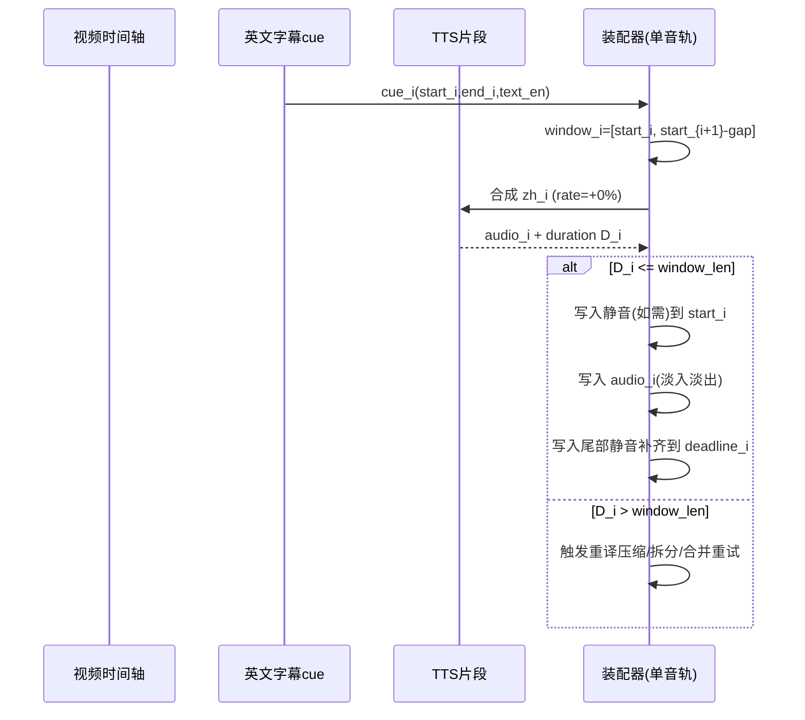

# 基于英文字幕的中文字幕与中文配音自动生成方案深度研究报告（DeepSeek 翻译 + 免费 Edge TTS + Rust/Tauri2 桌面端）

## 执行摘要

本报告给出一套在 **不改变视频播放速度**、**不改变配音语速**（TTS rate 固定为 +0%）、**避免配音片段重叠**、并尽量**保证音画同步**的端到端方案：以原英文字幕（SRT/ASS/VTT 等）时间戳作为“硬锚点”，用 **DeepSeek** 以结构化 JSON 输出模式生成可控长度的中文翻译字幕，再用“免费”的 **Microsoft Edge Read Aloud / Edge TTS**（通过开源 `edge-tts` 等实现）合成中文配音，最终在时间轴上进行“**不重叠排程 + 静音填充 +（必要时）合并/拆分重试**”来实现同步与无重叠。DeepSeek 提供 OpenAI 兼容的对话接口与 JSON Output 能力，可用 `response_format={"type":"json_object"}` 强约束输出结构，并要求 prompt 含 `json` 字样与示例，同时需设置合理 `max_tokens` 防止 JSON 中途截断。 citeturn24search0turn24search1

Edge TTS 侧，开源 `edge-tts` 已明确其 WebSocket 基础端点、默认受信 token、UA/头部策略与输出格式：服务 URL 基于 `speech.platform.bing.com/.../readaloud/edge/v1`，并带 `TrustedClientToken`；默认输出配置中包含 `outputFormat:"audio-24khz-48kbitrate-mono-mp3"`（24 kHz、48 kbps CBR、单声道 MP3），并在长文本场景通过“按字节长度切分（4096）+ 元数据/字节补偿”处理偏移累积。 citeturn23view0turn18view1turn21view3

需要重点提示：所谓“免费 Edge TTS”本质是对 Edge 浏览器“大声朗读（Read Aloud）”能力的复用，**无官方 SLA 与公开配额**，并存在 **403/401/429** 等风控与地区/UA 校验变化风险（例如社区曾遇到 403 握手错误、需要更新版本/UA 或实现额外参数 `Sec-MS-GEC` 等）。 citeturn22search5turn7search12turn23view0turn20view0 因此工程上必须内置：并发限流、重试退避、缓存、失败回退与可切换替代方案（例如走 Azure Speech 正式接口）。微软 SSML 文档显示 Azure Speech 支持 `<break>`、`<prosody>` 等丰富控制，但 Edge Read Aloud 生态常见实现会限制 SSML 仅支持 `speak/voice/prosody` 子集。 citeturn15search3turn15search6

## 目标与关键约束

本项目目标是：输入“**视频文件 + 已有英文字幕文件**（格式未指定）”，输出“**中文字幕文件** + **中文配音音轨**（可选覆盖或新增音轨）+ **可封装到容器的成片**”，并满足以下硬约束：

第一，**不改变视频播放速度**：不通过变速、抽帧、重计时改变视频时基；在封装阶段优先使用 `-c:v copy` 直拷贝视频流，只有在“烧录硬字幕”时才需要重编码（FFmpeg wiki 亦说明烧录字幕需 `subtitles`/`ass` 滤镜且依赖 `libass`，会改写视频流）。 citeturn12search2turn27search3

第二，**不改变配音速度**：TTS 的 rate 固定 `+0%`，不对生成音频做 `atempo`/time-stretch；允许通过“插入静音（停顿）”来填满窗口，但不通过改变语速来赶时。

第三，**避免配音片段重叠**：任何时刻只允许一个配音片段在时间轴上发声。实现上应将字幕 cue 视为“时间窗（time window）”，对每个窗输出一个“片段音频 + 必要静音”，并按时间顺序严格拼接，或在单轨上做“绝对时间写入”但保证片段区间不交叠。

第四，**音画同步**：以英文字幕时间戳作为对齐基准。若翻译后文本过长导致 TTS 片段超窗，应优先采用“翻译压缩/句子拆分/相邻窗合并”等方式在**不变速**前提下消解冲突，并记录偏差与回退策略。

字幕格式差异需要在入口讨论清楚：

SRT（SubRip）常见结构为：序号、时间轴行（`hh:mm:ss,mmm --> hh:mm:ss,mmm`）、文本行。其时间精度到毫秒，解析时要注意逗号小数分隔与多行文本。 citeturn1search1

WebVTT（`.vtt`）由 W3C 规范定义，cue 时间戳使用 `hh:mm:ss.mmm`，文件带 `WEBVTT` 头，cue 还可能含 settings 与简单标记。 citeturn1search0

ASS/SSA（Advanced SubStation Alpha/SubStation Alpha）是“脚本式字幕”，由多个 section 组成（例如 `[Script Info]`、`[V4+ Styles]`、`[Events]`），事件行（Dialogue）含 Start/End、样式、文本等字段，文本内部可嵌 override tags（`{...}`）与特殊换行符（如 `\n`、`\N`）。Aegisub 文档列出了 ASS override tags 与特殊字符规则。 citeturn11search3turn11search1

工程落地建议：统一解析为内部 `Cue {id,start,end,text,raw/style}` 结构；翻译与配音使用“去标签纯文本”，输出字幕时再按格式规则写回（ASS 需谨慎保留 override tags，避免破坏排版）。

## 系统架构与架构图

整体采用 **Tauri2 桌面应用（前端 UI + Rust 后端）**。Rust 负责：字幕解析、分段与对齐算法、DeepSeek/Edge TTS 调用编排、音频处理与封装；前端负责：文件选择、参数配置、进度显示、结果预览与导出。Tauri2 提供 command 系统从前端调用 Rust，命令可为 async，适合把重任务放在异步运行时防止 UI 卡顿。 citeturn26search2

对于 FFmpeg（以及可选的 Python `edge-tts`/Node `msedge-tts`），推荐用 **sidecar 外部二进制**方式随应用打包：Tauri 官方文档说明可通过 `bundle.externalBin` 嵌入 sidecar，并通过 `tauri-plugin-shell` 的 `shell().sidecar(...).spawn()` 启动，同时需要在 capabilities 中显式授权 `shell:allow-spawn/execute`。 citeturn26search0

进度与日志：从 Rust 向前端推送用事件系统 `emit/emit_to`，Tauri 文档同时提醒事件系统适合“少量数据/多生产者多消费者”，不适用于高吞吐低延迟大数据流；因此音频数据不要通过事件传，事件仅传进度与状态。 citeturn26search5

```mermaid
flowchart TD
  UI[Tauri2 前端 UI<br/>参数配置/进度展示/预览] -->|invoke commands| CMD[Rust Commands<br/>(async)]

  CMD --> PARSE[字幕解析器<br/>SRT/VTT/ASS]
  PARSE --> NORM[清洗与规范化<br/>去标签/合并空白/统一标点]
  NORM --> PLAN[分段与时间窗规划器<br/>合并/拆分/字数预算]
  PLAN --> DS[DeepSeek 翻译服务<br/>JSON Output 模式]
  DS --> SUBOUT[生成中文字幕文件<br/>SRT/VTT/ASS]

  PLAN --> TTSQ[TTS 任务队列<br/>并发限流/重试/缓存]
  TTSQ --> EDGE[Edge TTS 合成<br/>edge-tts 或自研WS客户端]
  EDGE --> POST[音频后处理<br/>解码/去首尾静音/重采样/淡入淡出]
  POST --> ASSEM[时间轴装配器<br/>按窗拼接+静音填充<br/>保证不重叠]
  ASSEM --> DUB[生成配音音轨<br/>WAV(中间)/AAC(成片)]

  DUB --> MUX[封装器<br/>FFmpeg sidecar]
  SUBOUT --> MUX
  MUX --> OUT[输出成片<br/>含中文配音+中文字幕<br/>(可多音轨/软字幕/硬字幕)]

  CMD -->|emit events| UI
```

## 数据流与时间轴对齐算法

### 时间基准与核心数据结构

统一时间基准建议用 **整数微秒或纳秒**，避免浮点误差扩散；最终音频写入时以采样率换算为“样本点索引”。

定义基本结构：

- `Cue`: 原字幕最小单元（start/end/text），来自解析器。
- `Segment`: 用于配音合成的单元，可由一个或多个 cue 合并而成（“句子级”），但仍保留 cue 映射以输出字幕。
- `Window`: 每个 Segment 的可用时间窗（start/deadline），deadline 用于保证“下一段前必须结束”。

关键思想：**以原字幕开始时间做锚点**，以“下一段开始时间”或“本段结束时间”做截止，构造“无重叠硬约束”的窗口，然后通过“翻译可控长度 + 合成后测时长 + 静音填充/必要重试”使每段音频严格落在窗口内。

### 利用英文字幕时间戳构建无重叠时间窗

将 cue 按 start 升序排序，得到 `c0..cN-1`。定义一个“硬不重叠截止”：

- `hard_deadline_i = start_{i+1} - safety_gap`（最后一段用视频时长或音频目标时长）
- 常用 `safety_gap` 取 30–80 ms（避免编码/播放器实现差导致贴边重叠）。

同时可定义一个“字幕显示截止”：

- `soft_deadline_i = end_i`（字幕本身消失时间）

在“严格音画同步”模式：deadline 取 `min(soft_deadline_i, hard_deadline_i)`，要求语音在字幕消失前结束，换取更强同步但更容易超窗。

在“容许尾音落入空隙”模式：deadline 取 `hard_deadline_i`，允许语音延伸到字幕空隙，但不跨到下一句开始，通常更容易成功且更自然。

实践建议：默认使用 `deadline=hard_deadline`，但若 gap 过大（例如 > 800 ms），可把中文字幕 end 也适度延长到语音结束（不超过 `hard_deadline`），避免“有声无字”。

### 句子拆分与合并策略

字幕经常“断句不友好”：一个英文句子被切到多个 cue。为了翻译质量与配音自然度，需要合并；为了时长可控，又需要拆分。推荐“先合并→再按窗回填”的两阶段策略：

合并（生成 Segment）建议使用确定性启发式（便于可测试）：

- 若相邻 cue 的 `gap = start_{i+1} - end_i` 很小（如 ≤ 150–250 ms），且当前 cue 文本末尾不含强终止标点（`.?!…` 等），则候选合并。
- 合并后的 Segment 总时长过长会降低可控性，可设上限（如 6–8 s）避免超长段。
- ASS 场景需额外考虑多层 Dialogue 同屏：若同一时间重叠显示多条 cue，单音轨配音无法并行，需进入“冲突解决”（见后文回退策略）。

拆分（将中文文本映射回 cue 或子片段）有两类需求：

- 字幕输出：通常希望一一对应 cue，保持原时间戳；因此翻译阶段就要产出 per-cue 中文文本数组。
- 配音输出：若单 cue 时间很短（例如 0.8 s）但信息量大，则需要把配音单位改为“跨多个 cue 的 Segment”或把中文拆成更短短语分配到连续窗口。

### 翻译长度控制与时长预算

不变速前提下，“能否落窗”主要取决于：中文文本长度、TTS 默认语速、以及窗口时长。

建议建立“字符/秒（CPS）”估计模型，并随 voice 校准。步骤：

- 选定 voice（例如 `zh-CN-...Neural`），固定 `rate=+0%`。
- 用固定长度中文样本文本合成一次，测得音频时长 `D_test`，字符数 `C_test`，得到 `cps = C_test / D_test`。
- 对每个窗口，按 `budget_chars = floor((window_sec - margin_sec) * cps)` 给出字数预算；`margin_sec` 可取 0.1–0.2 s 作为安全余量。

由于 `edge-tts` 实际输出为 24 kHz、48 kbps、单声道 CBR MP3，且其内部实现会根据累计字节数换算时间 tick 来补偿长文本漂移，这说明“合成音频时长可测且应以实际音频为准”。 citeturn21view3turn23view0

因此本方案不只依赖预算估计，而是采用“**合成后测时长闭环**”：

- 第一次按预算翻译并合成，得到真实时长 `D_tts`。
- 若 `D_tts <= window_sec - safety_gap`：接受；多余时间用静音填充。
- 若 `D_tts > window_sec - safety_gap`：进入压缩/拆分/合并重试（下节）。

### 合成语音时长测量与停顿调整

测时长的工程实现建议：

1) 让 Edge TTS 输出 MP3（默认配置中明确 `outputFormat:"audio-24khz-48kbitrate-mono-mp3"`）。 citeturn21view3turn20view0  
2) 用解码库（如 Rust `symphonia`）解码为 PCM，获取样本数 `N` 与采样率 `sr`，时长 `D = N / sr`。`symphonia` 文档说明其解码流程：从 `FormatReader` 取 `packet`，喂给 `Decoder` 返回 `AudioBufferRef`。 citeturn10search1turn10search5  
3) 由于后续要拼接，建议统一到目标采样率（常用 48 kHz，便于与多数视频音频一致）与固定声道数（1 或 2）。重采样可用 `rubato`（其文档强调重采样器创建昂贵、应复用并可 `reset()`）。 citeturn10search0turn10search12  

停顿调整（静音填充）规则：

- 设窗口 `[t_start, t_deadline)`，可用时长 `W = t_deadline - t_start`。
- 语音去首尾静音后的真实语音时长 `S`。
- 若 `S < W`：在语音尾部追加静音 `P = W - S`，保证下一段严格从 `t_deadline` 开始，避免累计漂移。
- 若 `S ≈ W`：追加 0 或极小静音（≤ 10ms）。
- 若 `S > W`：不得 time-stretch；进入回退策略。

去首尾静音建议做（提升落窗概率与听感）：

- 简单能量阈值法：以 10–20 ms frame 计算 RMS，低于阈值持续 X 帧视为静音。
- 更稳健可用 WebRTC VAD。Rust `webrtc_vad` crate 提供安全 API，并基于 libfvad/WebRTC VAD。 citeturn9search0turn9search5  

### 避免音频重叠与无缝拼接算法

核心目标是：**单音轨、严格单调时间推进**，因此最简单且可证明不重叠的方法是“按绝对时间写入 + 必要静音补齐”。

推荐的装配器（assembler）工作在 **样本点域**：

- 设目标采样率 `SR=48000`（或与原视频音轨一致），声道 `CH=2`。
- 对每个 Segment i，计算：
  - `start_sample = round(t_start_i * SR)`
  - `deadline_sample = round(t_deadline_i * SR)`
  - `window_samples = deadline_sample - start_sample`
- 将 TTS PCM（已重采样/转声道/去首尾静音）得到 `audio_samples`，长度 `len_audio`。
- 若 `len_audio > window_samples`：触发回退（不在此处硬裁）。
- 写入流程：
  1) 若当前写指针 `cursor < start_sample`：写入 `start_sample-cursor` 静音。
  2) 对 `audio_samples` 做淡入淡出（防爆音），再写入。
  3) 若 `cursor_after_audio < deadline_sample`：补静音直到 deadline。

淡入淡出（fade in/out）：

- 选 `fade_len` 取 5–15 ms（样本数 `fade_n = fade_len*SR`），对片头/片尾乘以线性 ramp。
- 该方式不引入“段与段重叠”，因此满足“避免重叠”的硬要求。

缓冲与流式处理：

- 大视频不宜把整条 PCM 留在内存。建议边生成边写 WAV：Rust `hound` 提供 WAV 读写能力与示例。 citeturn9search2turn9search9  
- 若使用 `ffmpeg` 后处理，也可直接写入临时 WAV，再转 AAC。

回退策略（当 `S > W`）按“保真优先→可控优先”排序：

- 语义压缩重译：要求 DeepSeek 输出更短中文（仍保留关键含义），再 TTS 重试。
- 句子拆分：把中文按标点/从句切成 2 段，分配到连续窗口（例如跨 2–3 个 cue）。
- 相邻窗口合并：若后一个窗口与本句同属一个 Segment，可将配音 Segment 合并为更大窗口（从第一句 start 到最后一句 deadline），字幕仍按 cue 展示。
- 终极降级：若仍无法落窗，可提示用户“该段超时不可避免”，提供选项：
  - 丢弃非关键信息（再次压缩）
  - 或（不推荐）硬裁剪并在尾部淡出，同时在字幕保留完整文本（会产生“字幕比配音长”的可感知不一致）

为适配 Edge TTS 可能的风控错误码，应对 429 的通用语义是：请求过多，可用 `Retry-After` 提示等待时间；MDN 对 429 与 `Retry-After` 有清晰定义。 citeturn7search8turn7search1

下面用示意时间线说明“无重叠拼接 + 静音补齐”：



## DeepSeek 使用示例与提示工程

### API 接入要点

DeepSeek 文档给出：API 与 OpenAI 格式兼容，`base_url` 为 `https://api.deepseek.com`（也可设置 `/v1` 仅为兼容路径，与模型版本无关）；调用对话接口路径示例为 `POST /chat/completions`，鉴权用 `Authorization: Bearer <API_KEY>`。 citeturn24search0

模型选择方面，文档说明 `deepseek-chat` 与 `deepseek-reasoner` 对应 DeepSeek-V3.2 的非思考/思考模式，并给出了上下文长度等信息。 citeturn8search2turn24search0

并发与限流方面：FAQ 指出当前阶段不设置硬性并发上限，但在系统总负载高时可能触发动态限流导致 503/429；“限速”页也说明高流量下请求可能需要等待，非流式会持续返回空行，流式会返回 SSE keep-alive，若 10 分钟仍未开始推理服务器会关闭连接。 citeturn24search7turn8search0

### JSON Output 模式与结构化翻译

DeepSeek 的 JSON Output 指南要求：

- 设置 `response_format={"type":"json_object"}`；
- system 或 user prompt 必须包含 `json` 字样并给出期望 JSON 示例；
- 要合理设置 `max_tokens` 防止 JSON 被截断；
- 该功能有概率返回空 content，需要通过调整 prompt 缓解。 citeturn24search1

因此建议把翻译输出定义为严格 JSON，例如：

```json
{
  "items": [
    {"id": 12, "zh": "……", "max_chars": 18, "note": "可选"}
  ]
}
```

并在 prompt 中同时传入每个 cue 的 `duration_ms` 与 `max_chars`，让模型在生成阶段就考虑“可朗读时长”。

### Rust 调用示例（reqwest）

```rust
use serde_json::json;

async fn deepseek_translate(api_key: &str, model: &str, payload: serde_json::Value)
-> Result<serde_json::Value, reqwest::Error> {
    let client = reqwest::Client::new();
    let resp = client
        .post("https://api.deepseek.com/chat/completions")
        .bearer_auth(api_key)
        .json(&payload)
        .send()
        .await?
        .error_for_status()?
        .json::<serde_json::Value>()
        .await?;
    Ok(resp)
}

fn build_translation_request(cues: &[(u32, u64, u64, String)], cps: f32) -> serde_json::Value {
    // cues: (id, start_ms, end_ms, text_en)
    let items: Vec<_> = cues.iter().map(|(id, s, e, en)| {
        let window_sec = (*e as f32 - *s as f32) / 1000.0;
        let max_chars = (window_sec * cps * 0.90).floor().max(6.0) as u32; // 预留10%余量
        json!({"id": id, "duration_ms": (e-s), "max_chars": max_chars, "en": en})
    }).collect();

    json!({
      "model": "deepseek-chat",
      "stream": false,
      "response_format": {"type": "json_object"},
      "messages": [
        {"role": "system", "content":
          "你是字幕本地化与配音脚本专家。请输出json。只输出合法json，不要输出多余文本。"},
        {"role": "user", "content": format!(
r#"请把以下英文字幕逐条翻译为简体中文，要求：
- 语义准确自然，适合配音朗读；
- 每条 zh 的长度不超过 max_chars（尽量更短但信息不丢）；
- 保留专有名词，可按中文习惯转写；
- 输出严格遵循以下 JSON 格式示例（注意字段名一致）：
{{"items":[{{"id":1,"zh":"示例"}}]}}
输入数据（json数组）：
{}"#, serde_json::to_string(&items).unwrap()
        )}
      ],
      "temperature": 0.2,
      "max_tokens": 2000
    })
}
```

上述请求遵循 DeepSeek 文档 `chat/completions` 与 JSON Output 要求：使用 `response_format`，并在 prompt 中显式包含 `json` 与示例格式。 citeturn24search0turn24search1

### 长度可控的提示工程与闭环重试

推荐采用“两段式闭环”：

- 第一轮翻译：按 `max_chars` 约束输出。
- 合成测时长后若超窗：二轮压缩 prompt 直接给出“必须缩到 N 字以内”的新目标，并附上“超窗比例”，让模型理解紧迫性。

压缩 prompt 片段示例（user content 内）：

> 你上一版 zh 合成后时长为 1.42s，但窗口只有 1.10s，超出 29%。  
> 请在不改变核心含义前提下，把中文压缩到 **不超过 10 个汉字**，避免解释性词语，保留关键信息。输出 json：{"id":12,"zh":"..."}。

并发/稳定性方面，考虑 DeepSeek 在高负载可能出现排队、空行 keep-alive、甚至 503/429 动态限流，需要实现：客户端超时（例如总等待 11 分钟内）、可取消、指数退避重试、以及对流式 keep-alive 的鲁棒解析。 citeturn8search0turn24search7

## Edge TTS 调用示例、参数与免费方案限制

### 首选集成方式与“官方/非官方”边界

严格意义上，Microsoft 的“免费 Edge Read Aloud”并非面向开发者的正式云 API；社区常用 `edge-tts` 等开源项目对其进行调用。`edge-tts` 仓库的实现清楚给出了其常量与接入方式：  
- `BASE_URL = "speech.platform.bing.com/consumer/speech/synthesize/readaloud"`  
- `WSS_URL = wss://.../edge/v1?TrustedClientToken=...`  
- `VOICE_LIST = https://.../voices/list?trustedclienttoken=...`  
并内置了 Edge/Chromium 风格 UA 与 WebSocket 头。 citeturn23view0

此外，社区 Node 实现也提示：Read Aloud API 需要匹配 Microsoft Edge 的 User-Agent，且仅支持 `speak/voice/prosody` 三类 SSML 元素。 citeturn15search6

结论：若你希望“尽可能稳”，建议把 Edge TTS 调用封装在可替换模块中，并提供“Azure Speech 正式 API”作为可切换后端（见替代方案）。

### 语音列表与 WebSocket 端点

基于 `edge-tts` 常量文件：

- 语音列表：`VOICE_LIST = https://speech.platform.bing.com/consumer/speech/synthesize/readaloud/voices/list?trustedclienttoken=...`  
- 合成 WS：`wss://speech.platform.bing.com/consumer/speech/synthesize/readaloud/edge/v1?TrustedClientToken=...` citeturn23view0

### `edge-tts` CLI 与 Python API 示例

CLI 常用参数：`--rate/--volume/--pitch` 可调。仓库说明当用负数值时要写成 `--rate=-50%` 以避免被解析为选项。 citeturn16search2

Python API（关键构造参数）在 `Communicate.__init__` 中可见：`rate/volume/pitch` 默认 `+0%/+0%/+0Hz`，`boundary` 可选 `WordBoundary`/`SentenceBoundary`（默认 SentenceBoundary），并支持 `proxy/connect_timeout/receive_timeout`；且文本会被 `split_text_by_byte_length(...,4096)` 按字节长度切分。 citeturn18view1

示例（作为 sidecar 或用户自备 Python 环境均可）：

```python
import asyncio
import edge_tts

async def run():
    communicate = edge_tts.Communicate(
        text="你好，欢迎收看本期节目。",
        voice="zh-CN-XiaoxiaoNeural",
        rate="+0%",
        volume="+0%",
        pitch="+0Hz",
        boundary="SentenceBoundary",
        connect_timeout=10,
        receive_timeout=60,
        proxy=None,  # 如需代理可填 "http://127.0.0.1:7890"
    )
    await communicate.save("seg_0001.mp3")

asyncio.run(run())
```

### 输出格式、时长对齐与片段元数据

`edge-tts` 的 WebSocket `speech.config` 明确设置 `outputFormat:"audio-24khz-48kbitrate-mono-mp3"`，并解释了其为 **48 kbps CBR**；同时实现了用累计字节数换算 100ns ticks 的补偿机制，以替代易漂移的元数据累积。 citeturn21view3turn23view0

这对本项目的意义是：  
- 你可以依赖“解码后样本数”得到稳定时长；  
- 不建议直接用服务端 `Offset/Duration` 做全局累计对齐（库作者甚至写明旧方案会漂移），而应以每段独立测时长 + 窗口装配为主。 citeturn21view3

### 免费方案限制与风控变化

必须正视的限制与变化点：

- **UA/地区风控导致 403**：GitHub issue #274 记录了 `WSServerHandshakeError: 403 ...`，建议更新版本或手动更新 User-Agent；更早的 issue #290 讨论了需要实现 `Sec-MS-GEC` token。 citeturn22search5turn7search12  
- `edge-tts` 实现中 WebSocket 连接参数拼接了 `&Sec-MS-GEC=...&Sec-MS-GEC-Version=...`，且 `SEC_MS_GEC_VERSION` 与 Chromium 版本绑定（`1-<CHROMIUM_FULL_VERSION>`）。 citeturn20view0turn23view0  
- **请求过载/限流**：服务可能返回 HTTP 429；429 表示在一段时间内请求太多，可通过 `Retry-After` 指示等待。 citeturn7search8turn7search1

工程建议的并发/速率控制（保守且可调）：

- Edge TTS：默认并发 1–2（桌面单机），超出后排队；遇到 429/403 自动降并发并退避重试。
- DeepSeek：虽不设硬并发上限，但高负载可能动态限流 503/429，且排队期会有 keep-alive，需超时与重试策略。 citeturn24search7turn8search0

Rust 侧并发限流可用 `tokio::sync::Semaphore`；Tokio 文档说明 Semaphore 允许多个并发调用者持有 permit，从而控制共享资源访问数量。 citeturn9search3

## Rust/Tauri2 实现要点、测试验证、开源库对比与替代方案

### Rust/Tauri2 的关键工程实现点

命令与 UI 交互：用 `#[tauri::command] async fn ...` 暴露处理入口，前端 `invoke()` 调用；文档强调命令可 async，重任务应异步执行避免 UI 冻结。 citeturn26search2

进度上报：Rust 用 `Emitter#emit` 向前端推事件；文档同时指出事件 payload 是 JSON，适合小消息，不适合大吞吐数据流。 citeturn26search5

FFmpeg 与 Edge-TTS sidecar：Tauri2 支持把外部二进制作为 sidecar 打包，并通过 `tauri_plugin_shell::ShellExt` 启动；`shell:allow-spawn/execute` 权限需要在 capabilities 中声明。 citeturn26search0

示例（从 Tauri 文档改写为“运行 ffmpeg sidecar 并读 stdout”）：

```rust
use tauri::{AppHandle, Emitter};
use tauri_plugin_shell::{ShellExt, process::CommandEvent};

#[tauri::command]
async fn run_ffmpeg(app: AppHandle, args: Vec<String>) -> Result<(), String> {
    let sidecar = app.shell()
        .sidecar("ffmpeg")
        .map_err(|e| e.to_string())?
        .args(args);

    let (mut rx, _child) = sidecar.spawn().map_err(|e| e.to_string())?;

    tauri::async_runtime::spawn(async move {
        while let Some(event) = rx.recv().await {
            if let CommandEvent::Stdout(line) = event {
                let s = String::from_utf8_lossy(&line).to_string();
                let _ = app.emit("ffmpeg:stdout", s);
            }
        }
    });

    Ok(())
}
```

sidecar 的配置与权限模型细节见官方文档。 citeturn26search0

音频处理链路（推荐组合）：

- 解码：`symphonia`（纯 Rust，多格式解复用/解码）。 citeturn10search5turn10search1  
- 重采样：`rubato`（离线批处理也适配，建议复用 resampler）。 citeturn10search12turn10search0  
- WAV 写入：`hound`（写中间 WAV，便于 FFmpeg 再封装）。 citeturn9search2turn9search9  
- VAD（可选）：`webrtc_vad`（更稳健裁静音）。 citeturn9search5turn9search0  

字幕解析与写回：

- `subparse`：docs.rs 明确其提供对 `.srt/.ssa/.ass/.idx/.sub` 等常见字幕格式的非破坏性解析/修改/保存接口。 citeturn27search2  
- 对 VTT：若不选库，可按 W3C WebVTT 规范自研 parser；但为了减少 bug，建议优先用成熟库并补齐 VTT（必要时自实现转换）。 citeturn1search0turn27search2  

ASS 硬字幕渲染（如需内嵌到画面）：

- FFmpeg 的 `subtitles/ass` 滤镜基于 `libass` 渲染 ASS/SSA；FFmpeg wiki 说明使用该滤镜需要编译时启用 `--enable-libass`。 citeturn12search2turn27search3  
- 若你需要在应用内渲染预览字幕（而非交给 FFmpeg），`libass` 本身也是可集成选项。 citeturn27search3  

### FFmpeg 封装建议

输出策略建议分两类：

- 多音轨 + 软字幕（推荐）：保留原音轨（英文原声）作为 Track 0，中文配音作为 Track 1，字幕作为可开关字幕轨。这样最符合“可回退”与“多语言”需求。
- 替换/混音：若要完全配音，可用 `-map` 选择中文音轨覆盖；若要混音（保留背景），需额外 `amix` 且会出现“人声叠加”，与“避免重叠”目标冲突，除非你只把中文配音当旁白并降低原声。

硬字幕（烧录）只有在目标播放器不支持字幕轨或要发布到 Web 平台时才考虑，因为它会重编码视频流。 citeturn12search2

### 测试用例设计与自动验证方法

建议把测试分为“纯算法单元测试 + 端到端集成测试 + 回归对齐指标”。

单元测试（不依赖外部网络）：

- 字幕解析：覆盖 SRT/VTT/ASS 的边界输入（多行、空行、BOM、ASS override tags、`\\N` 换行等）。ASS tags 与特殊字符规则可参考 Aegisub 文档。 citeturn11search1  
- 时间窗构建：随机生成 cue 序列，验证 `deadline_i <= start_{i+1}`，且 `window_len>=0`。
- 拼接器：给定若干“假音频片段长度”，验证输出音频总样本数等于最后 deadline，且从不出现写指针回退。

集成测试（可选离线/在线两套）：

- 在线：对固定字幕样例调用 DeepSeek 与 Edge TTS，生成配音与字幕；记录每段 `D_tts`、重试次数、是否落窗。
- 离线：用 mock TTS（例如用固定正弦波长度模拟音频片段）验证对齐与拼接逻辑，避免网络不稳定导致 CI 波动。

自动对齐度量指标（建议输出到报告/日志）：

- `start_error_ms[i] = |scheduled_start_ms[i] - actual_start_ms[i]|`（装配器理论应接近 0，误差主要来自采样换算与封装延迟）
- `overrun_ms[i] = max(0, D_tts_ms[i] - window_ms[i])`（目标为 0）
- `window_utilization[i] = speech_ms[i] / window_ms[i]`（过低说明停顿过多，过高接近上限风险大）
- “不重叠证明”：验证 `actual_end_ms[i] <= actual_start_ms[i+1] - safety_gap`

对“封装后”的验证可以用 ffmpeg/ffprobe 解码回 PCM，再跑一次能量/VAD 检测语音起点，检查是否与字幕 start 对齐（这能捕获 AAC priming 等封装播放差异）。即使不引入新依赖，也可把该步骤作为 power-user 的“诊断模式”。

容错场景（必须覆盖）：

- 极短 cue（< 400 ms）：基本无法朗读完整语义，必须触发压缩/合并。
- cue 时间戳重叠：尤其 ASS 可能多层同屏，对单音轨配音是天然冲突，应提示用户并选择“优先级规则”（例如只读主层/最长文本/指定 speaker）。
- Edge TTS 403/401：应自动降并发、提示切换网络/代理、或切换到替代 TTS。
- DeepSeek 空 content（JSON mode 已知概率问题）：应自动重试并增强 prompt 示例。 citeturn24search1  

### 推荐开源项目与库对比表

| 组件 | 推荐项目/库 | 优点 | 局限/风险 |
|---|---|---|---|
| 字幕解析/写回 | `subparse` (Rust) | 支持多种常见字幕格式（`.srt/.ssa/.ass/.idx/.sub`），强调非破坏性解析、可修改再保存。 citeturn27search2 | VTT 不在其主列举格式中，若输入为 `.vtt` 需自研或另选库/转换。 |
| 翻译 LLM | DeepSeek API（OpenAI 兼容） | 官方文档给出 `chat/completions`、base_url、模型映射；支持 JSON Output 强结构化，适合字幕逐条输出。 citeturn24search0turn24search1 | 高负载可能动态限流 503/429、排队 keep-alive；JSON Output 可能返回空 content，需要重试与 prompt 调整。 citeturn24search7turn24search1 |
| 免费 TTS（Read Aloud） | `edge-tts` (Python) | 给出明确 WS/voice-list 端点、UA/头部、`Sec-MS-GEC` 等连接细节；支持 rate/volume/pitch 与 boundary 元数据。 citeturn23view0turn18view1turn21view3 | 非官方免费通道：UA/地区风控变化会导致 403/401；需并发限流、缓存、回退与可配置代理。 citeturn22search5turn7search12 |
| 音频解码 | `symphonia` (Rust) | 纯 Rust，多容器/多编码支持，适合桌面端跨平台。 citeturn10search5turn10search1 | 需要正确选择 feature flags 才能覆盖目标编码；性能与 ffmpeg 相比可能略有差异（需基准）。 |
| 重采样 | `rubato` (Rust) | 灵活的采样率转换，支持批处理；文档建议复用 resampler 降低开销。 citeturn10search12turn10search0 | 需做 float PCM 转换；工程上要注意通道布局与交错/非交错格式。 citeturn10search8 |
| WAV 写入 | `hound` (Rust) | 简单可靠写 WAV，中间格式友好，便于 FFmpeg 再封装。 citeturn9search2turn9search9 | 仅 WAV；最终封装到 MP4/MKV 仍需 FFmpeg 或编解码库。 |
| VAD（静音裁剪） | `webrtc_vad` (Rust) | 基于 WebRTC VAD，适合裁剪首尾静音以更好落窗。 citeturn9search0turn9search5 | 依赖 C 编译链（libfvad），打包时要处理构建环境。 citeturn9search0 |
| 硬字幕渲染 | `libass` | 业界通用 ASS/SSA 渲染库；FFmpeg `subtitles/ass` 滤镜依赖它。 citeturn27search3turn12search2 | 集成成本较高（字体、平台依赖），且硬字幕必然重编码视频。 citeturn12search2 |
| 侧车编排 | Tauri2 `plugin-shell` sidecar | 官方支持打包外部二进制并从 Rust/JS 启动；能力授权模型清晰。 citeturn26search0 | 需要为不同 target triple 准备二进制；权限配置出错会导致无法启动。 citeturn26search0 |

### 可能的限制与替代方案

- Edge TTS 免费通道不稳定：若持续出现 403/401、或对并发/配额有确定性要求，应切换到 **Azure Speech 正式 TTS**。微软 SSML 文档展示 Azure Speech 可用 `<break>`、`<prosody>` 等精细控制，适合“用 SSML 直接把停顿写进合成语音”以降低后处理复杂度。 citeturn15search3turn15search1  
- 离线 TTS：如需完全离线、避免网络与风控，可考虑本地神经 TTS 引擎。例如 `rhasspy/piper` 被描述为“fast, local neural text to speech system”（但仓库已归档为只读），`coqui-ai/TTS` 提供可本地运行/训练的 TTS 工具链。 citeturn27search0turn27search1  
- 字幕格式覆盖：若必须完整支持 VTT 编辑与写回，需选择支持 VTT 的库或实现转换；SRT/VTT/ASS 互转也可考虑其他库，但要评估成熟度与无损性目标（例如 `subparse` 强调保留格式信息）。 citeturn27search2turn1search0  

以上方案的关键成功点在于：把“翻译质量”与“时长可控/可落窗”同时建模，并通过 **合成后测时长的闭环重试**与 **单音轨严格窗口装配**实现不重叠同步；同时把 Edge TTS 的不确定性视为系统性风险，在架构上预留替代后端与强健的限流、重试、缓存与诊断能力。